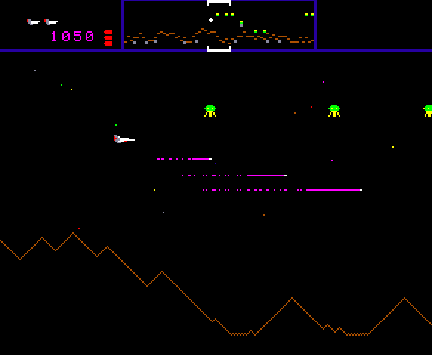
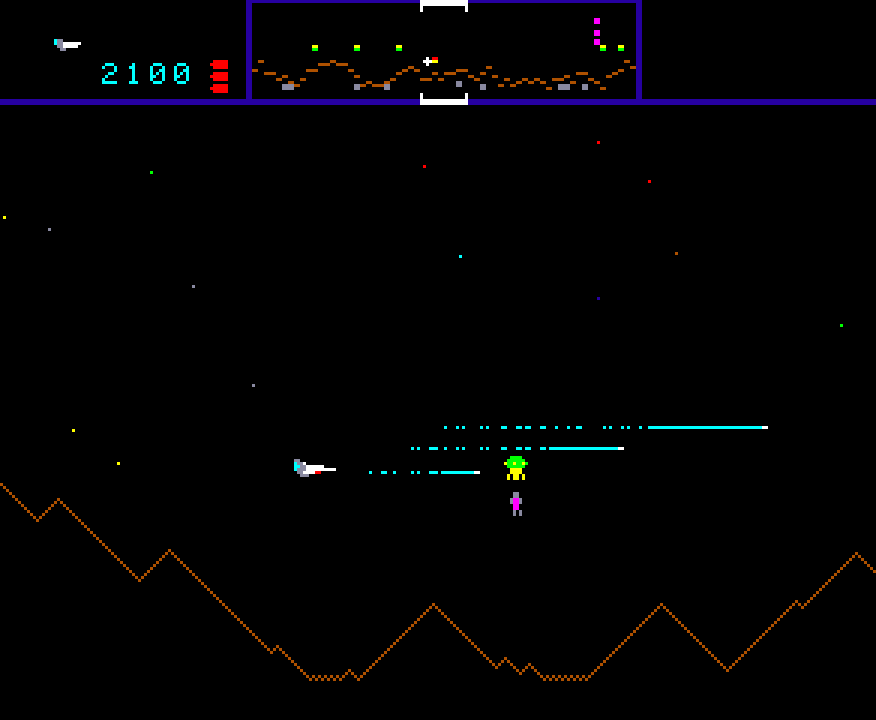
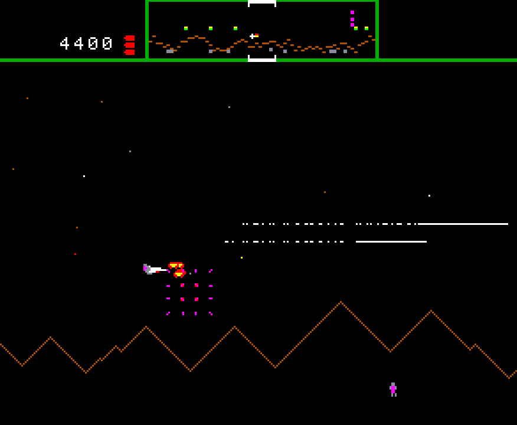
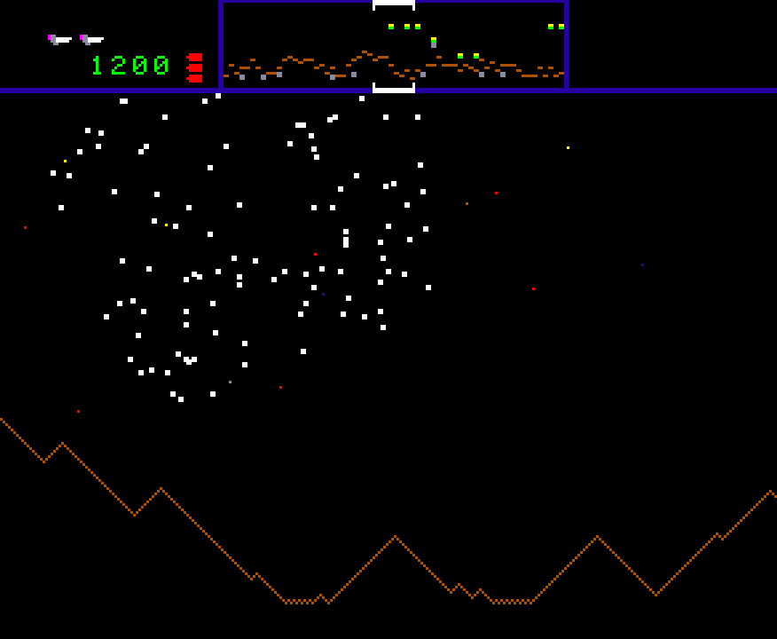
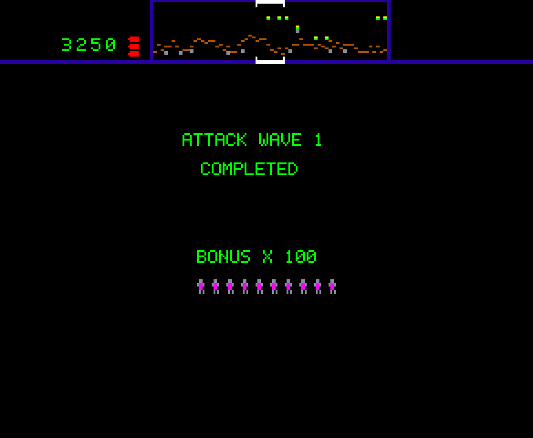
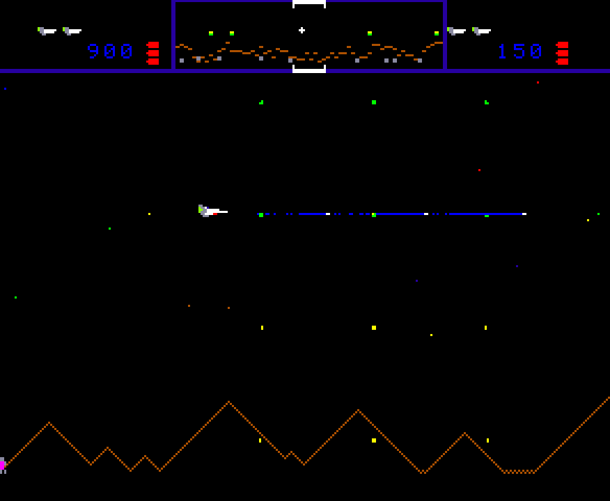
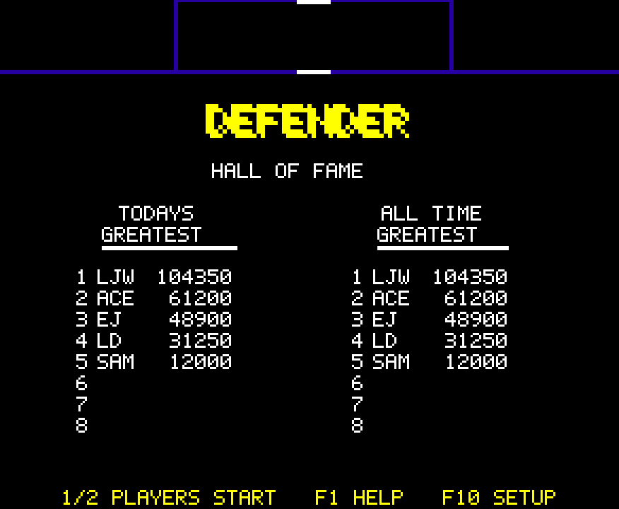
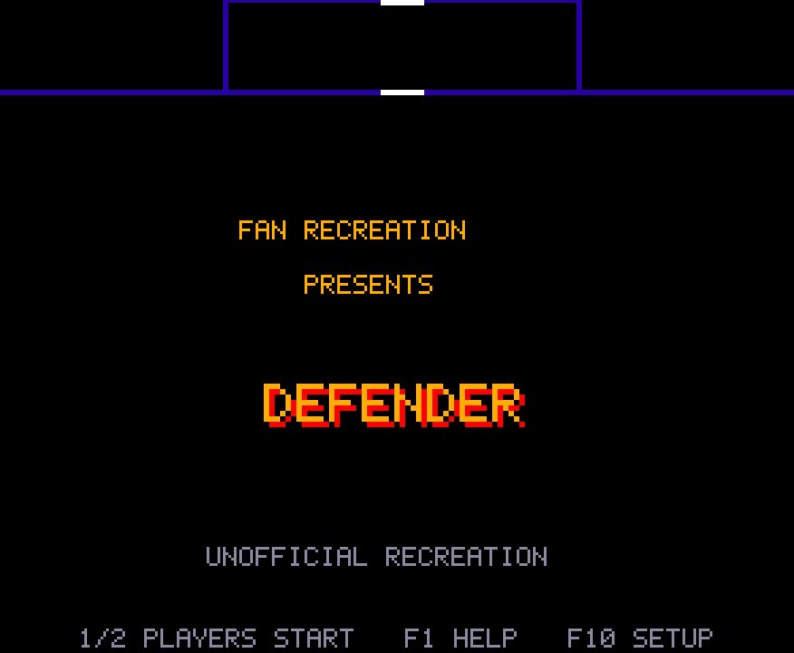
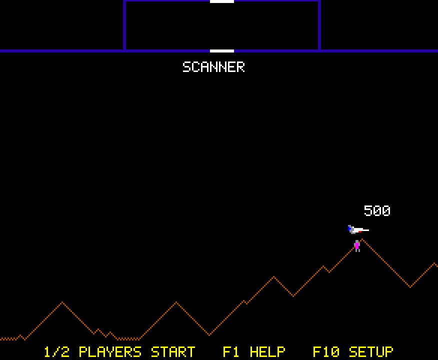
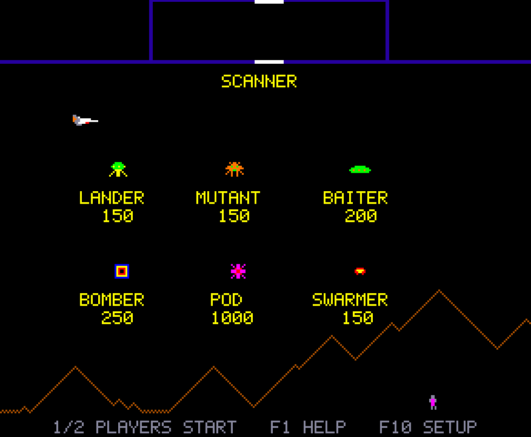

# Defender (1981) — unofficial recreation



This is a recreation of Williams Electronics' 1981 arcade game *Defender*, built with .NET 10, C# and Avalonia. It reproduces the original's mechanics, using the Red Label arcade source code as evidence:

- the five-button controls;
- momentum physics on a wrap-around planet 2048 pixels wide;
- the scanner (the minimap across the top of the screen);
- abductions of humanoids, which turn Landers into Mutants;
- the planet exploding when every humanoid is lost;
- smart bombs and the risky hyperspace jump;
- the original wave tables.

The game is played offline by a single player. The art and sound are original work; nothing is taken from the arcade ROMs.

It has two presets, **Classic** and **Modern**. Both use the same rules. Modern adds conveniences that are disclosed in the game: pause on focus loss, suspend/resume, optional hold-to-fire, flash suppression, and adjustable speed.

## Screenshots

| | |
|---|---|
|  |  |
| A lander abducting a humanoid | Explosions spread the enemy's own pieces |
|  |  |
| Losing a ship | End-of-wave humanoid bonus |
|  |  |
| Two players take turns | Hall of Fame (Today's and All-Time) |
|  |  |
| Attract mode title page | Attract demo: the rescue |
|  | |
| Attract demo: the enemies and their points | |

The screenshots are rendered by the game itself (`--screenshots screenshots/`, deterministic), so they can be regenerated whenever the visuals change.

## Download

Every push to `main` refreshes the **[latest pre-release](https://github.com/Harlock123/AVADefend/releases/tag/latest)**; version tags (`v0.1.0`, …) make proper [releases](https://github.com/Harlock123/AVADefend/releases). Each is a single self-contained program, no .NET install needed:

| Platform | File |
|---|---|
| Windows (x64, x86, Arm64) | `AVADefend-win-x64.zip` (and `-win-x86`, `-win-arm64`) |
| macOS (Apple Silicon, Intel) | `AVADefend-osx-arm64.tar.gz`, `AVADefend-osx-x64.tar.gz` |
| Linux (x64, Arm64, Arm) | `AVADefend-linux-x64.tar.gz` (and `-linux-arm64`, `-linux-arm`) |

Unzip or untar and run `Defender` (`Defender.exe` on Windows). The builds are not code-signed: on macOS run `xattr -d com.apple.quarantine Defender` once (or right-click → Open); on Windows choose *More info → Run anyway* if SmartScreen asks. `Defender --selftest` prints a quick check of graphics, sound and gamepad support without opening a window.

**Documentation**

| File | Contents |
|---|---|
| RESEARCH.md | What we found out about the original, and from which sources |
| FIDELITY.md | How closely each system matches the original, and how Classic and Modern differ |
| ARCHITECTURE.md | How the code is organised |
| CONTROLS.md | Keyboard and gamepad controls |
| SAVES.md | Settings, high-score and suspend files |
| THIRD_PARTY.md | Licences and where every asset came from |
| KNOWN_ISSUES.md | Untested platforms, uncertain behaviour, missing features |
| MILESTONE_STATUS.md | Progress against the project plan |

> **Unofficial fan project.** It is not affiliated with or endorsed by Williams Electronics or its successors, and it is not cleared for public distribution. See THIRD_PARTY.md.

## Prerequisites

- **.NET SDK 10.0.** Verified with 10.0.400 and runtime 10.0.11.
- **Linux:** an X11 or XWayland session. Every other native library the game needs ships in its NuGet packages: SDL2 (audio and gamepad), Skia and HarfBuzz.
- **Windows and macOS:** no extra requirements. Note that the game has **not been run** on either (see KNOWN_ISSUES.md).

## Build, test, run

```bash
dotnet build Defender.slnx                      # Debug build of all projects
dotnet test Defender.slnx                       # 194 tests (engine, persistence, audio mixer, headless Avalonia UI)
dotnet run --project src/Defender.Avalonia      # play
```

Diagnostic flags:

```bash
dotnet run --project src/Defender.Avalonia -- --autoplay      # a scripted pilot plays (for screenshots and soak runs)
dotnet run --project src/Defender.Avalonia -- --audio-probe   # report the SDL audio status and play every sound, no window
dotnet run --project src/Defender.Avalonia -- --export-sounds sounds/   # write every effect as a WAV file to audition
dotnet run --project src/Defender.Avalonia -- --selftest      # windowless platform check: engine, renderer, native libs, data dir, audio, gamepad
dotnet run --project src/Defender.Avalonia -- --screenshots screenshots/   # regenerate the README screenshots
```

In the game:

| Key | Action |
|---|---|
| **1** or **F2** | Start a 1-player game |
| **2** or **F3** | Start a 2-player game (players alternate on death) |
| **F1** | Show the controls |
| **F10** or **F9** | Settings and key remapping |
| **F11** | Fullscreen |

## Publish

The release builds are single-file, self-contained programs (exactly what CI produces):

```bash
dotnet publish src/Defender.Avalonia/Defender.Avalonia.csproj -c Release -r linux-x64 --self-contained true \
  -p:PublishSingleFile=true -p:IncludeNativeLibrariesForSelfExtract=true -p:IncludeAllContentForSelfExtract=true \
  -p:EnableCompressionInSingleFile=true -p:DebugType=none -o publish/linux-x64
```

Use `win-x64`, `win-x86`, `win-arm64`, `linux-arm64`, `linux-arm`, `osx-x64` or `osx-arm64` for the other platforms. The executable is called `Defender` (`Defender.exe` on Windows). The linux-arm64 single-file build has been run (window, sound, `--selftest`); the others are first exercised by CI.

## Continuous integration and releases

`.github/workflows/build.yml` (the same scheme as AVABand and AVAUltima3):

1. **test**: Release build with warnings as errors, then the full test suite.
2. **publish**: single-file builds for the 8 platforms above, zipped (Windows) or tar.gz'd (others) with the README, CONTROLS and THIRD_PARTY notes.
3. **selftest**: the Windows x64, macOS Arm64 and Linux x64 packages are downloaded onto real machines of each OS and started with `--selftest`.
4. **release**: on `main`, replaces the rolling `latest` pre-release; on a `v*` tag, creates a proper release with generated notes.

## Repository map

```
src/Defender.Core            simulation (no UI/OS dependencies)
src/Defender.Infrastructure  persistence, SDL audio, SDL gamepad
src/Defender.Avalonia        desktop app, software renderer, settings UI
tests/Defender.Tests         xUnit v3 + Avalonia headless tests
docs/research                full research dossiers with citations
```
